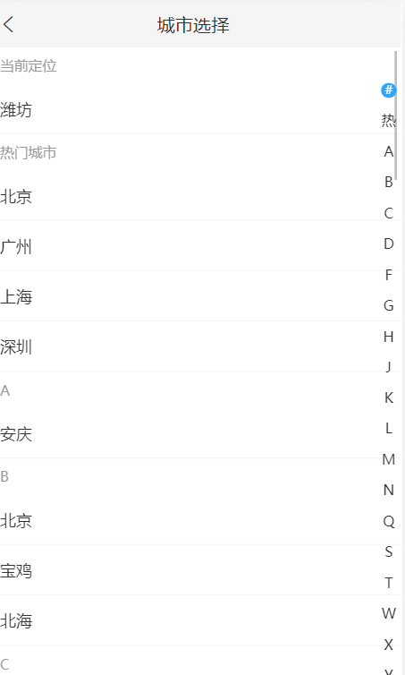
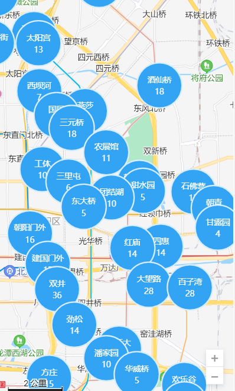
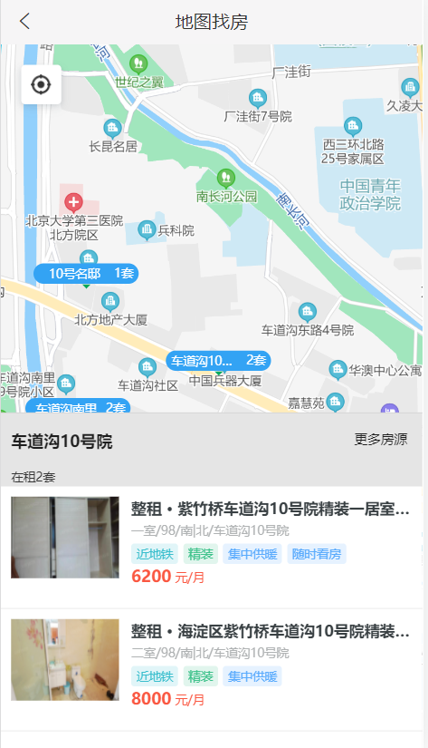
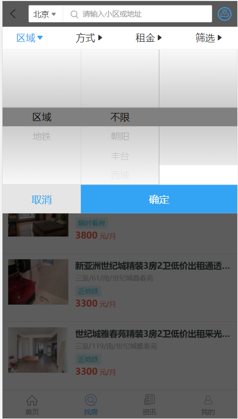

# 凉介租房项目

## 附gitee提交记录


## 1. 使用的技术栈

### 1.1 前端

- React
- React-router-dom
- ant design mobile
- jsx
- 百度地图API
- scss
- react-vertualize
- render-props
- HOC
- redux
- lazy-load

### 1.2 服务端

- NodeJS
- Mysql
- koa

## 2. 目录结构

```html
node_modules    nodejs模块依赖
public          公共资源文件
/src
/assets       资源文件，比如：图片、字体等
/components   公共组件，多个页面中都需要用到的组件
/pages        页面组件
/utils        工具函数、方法
App.js        根组件（用来配置路由等）
index.js      整个项目的入口文件
.env.development  开发环境环境变量配置
.env.production   生产环境环境变量配置
```

## 3. 启动该项目

1. `npm install` 安装node依赖模块
2. `yarn start` 或者`npm start启动项目`
3. 或者使用 `npm build` 打包该项目, 把打包生成的dist文件夹下面的文件上传到web服务器中即可运行

## 4. 主要模块和功能点

### 4.1 项目整体配置

1. 使用react-router-dom中的BrowserRouter来控制项目的整体路由跳转, Router组件匹配路由信息,Redirect组件实现路由的重定向
2. 使用antd-mobile组件库辅助进行页面的结构和样式辅助; 并使用  `react-app-rewired ` `customize-cra` 使组件库实现按需引入,解决全部引入导致的打包体积过大的问题;
3. 使用axios请求拦截器和相应拦截器,对需要token字段的请求进行统一处理; 相应拦截器实现对异常请求的统一处理,简化了具体模块中的代码,是核心逻辑更简洁
4. **React.lazy()+ import(),Suspence组件** 把项目按照路由进行分割, 提高首屏加载速度

### 4.2 首页模块

#### 4.2.1 城市列表选择功能

1. 对后台返回的城市数据按照索引(字母)进行排序;
2. 使用百度地图提供的api获取当前城市信息,并展示在列表顶部
3. 使用`react-vertualize` 库中提供的API,实现对城市列表和索引的渲染, 用户可以根据索引快速定位想选择的城市
   

#### 2. 轮播图

1. 使用`antd-moble`中的Coursel组件,实现对轮播图的渲染, 通过props控制每张轮播图的停留事件

#### 3. 租房小组,最新资讯

1. 使用flex布局, 使页面能兼容多种移动端设备

### 4.3 找房模块(核心业务)

#### 4.3.1 地图找房模块

1. 使用百度地图API, 通过用户选择的城市定位,渲染当前城市的地图信息;并添加了比例尺和缩放控件,提升用户体验
2. 通过axios想后台发送请求,获取城市对应曲线下的具体房源信息; 通过百度地图提供的API渲染不同层级的label
3. 通过点击label, 用户可以获取到不同行政区(街道)下的房源信息,最终可以定位到具体小区下面的房源
   



#### 4.3.2 列表找房页面

用户可以通过具体条件和输入搜索来获取对应房屋信息


##### 条件筛选查找

1. Filter组件设计(筛选条件组件)
   1. 包含4个子组件,分别包含了区域,方式,租金,详细条件4个选择大类; 在Filter组件中通过axios获取筛选条件数据,在根据子组件的props把对应的数据传递给4个子组件; 选择时,
      子组件会更新state,并在保存时会把所有的选择条件通过回调函数传递给父组件
   2. 列表页(Filter父组件)用户点击确定之后, Filter组件会将state中的数据处理后,通过回调函数传递给父组件(以对象的形式),并根据这些条件返回对应的数据列表
2. 对于长列表的性能优化: 由于该系统数据量较大,一次性加载全部数据会导致页面滑动卡顿; 因此对于列表数据进行了懒加载处理; 通过一次性暂时加载20条数据, 当用户滑动的item个数超过15之后,自动调用loadMoreRows()
   方法,并更新state,实现更多数据的加载;

##### 搜索框查找房源

1. 通过受控组件的形式获取搜索框的value
2. 根据onchange事件回调函数更新state和发送请求
3. 由于onChange事件执行频率过高,导致请求太频繁,服务器压力过大,因此使用函数的柯里化封装了防抖函数, 有效减少了请求次数
4. 模糊匹配法查询到用户输入的房源数据后,用户具体点击某一项后, 使用props的history中的方法返回列表搜索页,并将搜索项的id作为参数带到列表搜索页; 列表页中根据本次返回的id值查询小区下面的房源数据;

#### 4.3.3 房源详情模块


1. 当通过条件筛选或搜索框查询当对应房源数据之后, 点击相应的数据进入房源详情页
2. 通过路由参数获取房源id,通过axios发送请求获取详情数据
3. 房源收藏功能:
   - 点击底部按钮收藏,把房源添加到"我的收藏"; 该功能需要用户登录; 如果用户已登录,正常添加到收藏列表;如果未登录,提示用户去登录
4. 在线咨询:
   - 该功能正在开发中

5. 电话预约
   - 该功能正在完善, 当点击该按钮,会拨打该房源对应中介的电话号码